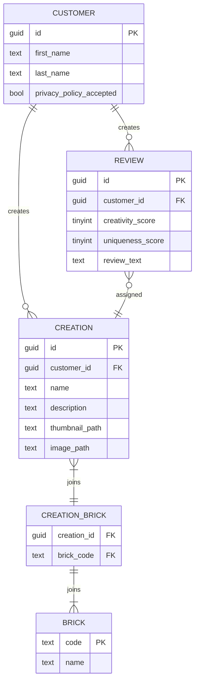

## About The Project

NPU is a fan term that stands for Nice Part Usage and it refers to a brick element being used in a new
and unexpected way, yet it perfectly fits the overall build (such as the frog elements on the Bonsai
Tree below). The platform lets the users score others' creations based on creativity and uniqueness.

The application uses the [Clean Architecture Solution Template](https://github.com/jasontaylordev/CleanArchitecture).

### Built With

This section lists all the major frameworks/libraries used to bootstrap this project.

* [Clean architecture template](https://github.com/jasontaylordev/CleanArchitecture)
* [.NET 7](https://dotnet.microsoft.com/en-us/download/dotnet/7.0)
* [MediatR](https://github.com/jbogard/MediatR)
* [FluentValidation](https://docs.fluentvalidation.net/en/latest/)
* [AutoMapper](https://automapper.org/)
* [FluentAssertions](https://fluentassertions.com/)
* [NUnit](https://nunit.org/)
* [Moq](https://github.com/devlooped/moq)
* ...

## Getting Started

How to get it running locally.

### Prerequisites

You need to have .NET 7 runtime installed before running this solution. Optionally, if you prefer to run it in containers, you have Docker installed.

## Services

### Customer Management service

This service is responsible for handling customer handling-related operations, including authentication, authorization, registration, etc.
The service publishes the following asynchronous messages:
- `CustomerRegistered`
- `CustomerUpdated`
- `CustomerDeleted`

### Agreements service

This service is responsible for managing agreements. Currently supported agreement types:
- Terms and conditions
- Privacy policy

The service publishes the following asynchronous messages:
- `AgreementCreated`
- `AgreementUpdated`

### Catalog service

This service is responsible for managing products, including sets and bricks.

The service publishes the following asynchronous messages:
- `BrickCreated`
- `BrickUpdated`
- `BrickArchived`

Note: bricks are never deleted, but rather archived.

### Creations service

This service is responsible for a social hub of community-made creations.

The service may publish (not implemented yet) the following asynchronous messages:
- `CreationCreated`
- `CreationUpdated`
- `CreationDeleted`
- `ReviewCreated`
- `ReviewUpdated`
- `ReviewDeleted`
- ...

#### Notes, design decisions

- The application uses an in-memory database for the sake of simplicity. The integration tests use the same. In a real-word scenario, I'd use a relational database like provider MS SQL or PostgreSQL.
- Authentication and authorization is not implemented for the sake of simplicity
- `Customer` and `Brick` tables serve as a local cache of remote data (owned by their respective microservices). They are maintained with asynchronous integrations (messages). In a real-world scenario, it is to be reviewed whether the privacy policy check should be an on-line check.

#### Database schema

## Roadmap

- [x] Implement a basic version fo the `Creations` service
- [ ] Adding observability features to the `Creations` microservice (metrics, tracing, logging)
- [ ] Implement `Customer Management` microservice and add authentication, authorization
- [ ] Listen to events sent by `Customer Management`
- [ ] Implement Agreements API
- [ ] Implement `Catalog` service and have `Creations` service listen to brick-related events
- [ ] ...

See the [open issues](https://github.com/othneildrew/Best-README-Template/issues) for a full list of proposed features (and known issues).

## Contributing

Contributions are what make the open source community such an amazing place to learn, inspire, and create. Any contributions you make are **greatly appreciated**.

If you have a suggestion that would make this better, please fork the repo and create a pull request. You can also simply open an issue with the tag "enhancement".
Don't forget to give the project a star! Thanks again!

1. Fork the Project
2. Create your Feature Branch (`git checkout -b feature/AmazingFeature`)
3. Commit your Changes (`git commit -m 'Add some AmazingFeature'`)
4. Push to the Branch (`git push origin feature/AmazingFeature`)
5. Open a Pull Request

<!-- MARKDOWN LINKS & IMAGES -->
[.NET]: https://img.shields.io/badge/.NET-5C2D91?style=for-the-badge&logo=.net&logoColor=white
[.NET-url]: https://dotnet.microsoft.com/en-us/
